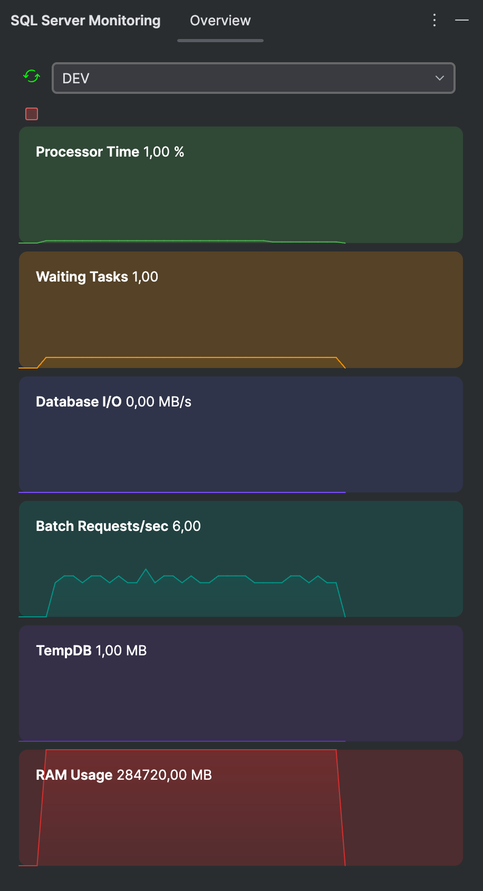

<h1>
  
  SQL Server Monitoring
</h1>

JetBrains plugin to monitor SQL Server databases.

## 🚀 Features

- [Demo video](assets/demo.mov)
- Monitor SQL Server databases from data sources defined in JetBrains IDEs (DataGrip, IntelliJ IDEA Ultimate, etc.).
- View real-time performance metrics such as :
    - CPU usage in percent
    - Waiting tasks
    - I/O usage in MB per second
    - Batch requests per second
    - Total TempDB size in MB
    - RAM usage in MB

  

## 🎨 Crédit Graphique
Les logos ont été créés par [Irene CERRO](https://github.com/pandairene7).
Merci pour son excellent travail créatif !

## ⚖️ License
This project is licensed under the MIT License. See the [LICENSE](LICENSE.md) file for details.

## 📭 Contact
- Author : Owen ANCELOT
- Email : [ancelotow@icloud.com](ancelotow@icloud.com)
- GitHub : [Ancelotow](https://github.com/Ancelotow/)